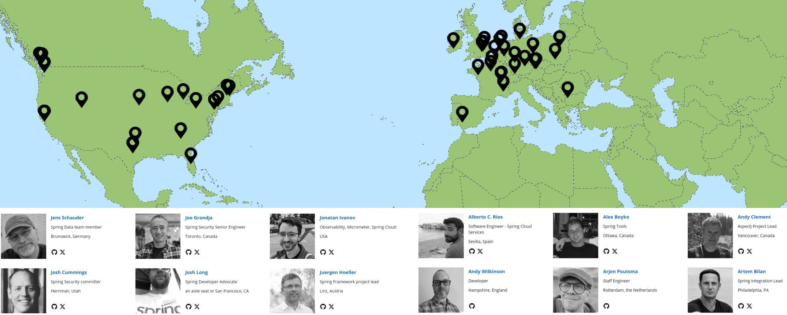

  
# Introduction

The [*Spring Framework*](http://spring.io) (2002) is a *Java application development framework*
that has been developed by VMWare since 2002 as open-source alternative to
[*Java EE / Jakarta EE*](https://en.wikipedia.org/wiki/Jakarta_EE)
frameworks (*EE:* Enterprise Edition) with many commercial implementation, e.g.
*SAP NetWeaver*,
*RedHat JBoss, Wildfly,
*Oracle WebLogic* or
*IBM WebSphere* application servers.

[*Spring Boot*](https://spring.io/projects/spring-boot) (2014) is a newer, more modular and improved implementation.
It is the basis of many large, Java-based business applications today.

Main advantages of *Spring Boot* over *Java EE / Jakarta EE* are:

- stand-alone execution of applications without application server
    (one executable .jar file).

- embedded components such as embedded HTTP-servers
    ([*tomcat*](https://tomcat.apache.org)) or databases
    ([*h2*](https://h2database.com/html/main.html), *derby*).

- modular structure controlled through *maven* dependencies. The resulting executable .jar only
    includes parts needed by the applications keeping applications small at runtime.

- annotation-based configuration avoiding the myriad of *xml*-based configuration files
    used in *Java/Jakarta EE* or classic *Spring* applications.

*Spring* implements many (not all)
[Java/Jakarta EE specifications](https://jakarta.ee/specifications)
(e.g. *servlet*, *JPA*, *Bean* specifications).

*Spring* and *Spring Boot* documentation is extensive:

- [Spring Framework Documentation](https://docs.spring.io/spring-framework/reference),
    [Spring Guides](https://spring.io/guides),

- [Spring Core Technologies](https://docs.spring.io/spring-framework/reference/core.html)
    with the
    [IoC Container](https://docs.spring.io/spring-framework/reference/core/beans.html),

Meet the global Spring [development team](https://spring.io/team):



Check out upcoming Spring [Events](https://spring.io/events) or
Spring Boot's [Youtube channel](https://www.youtube.com/playlist?list=PLgGXSWYM2FpOa_FTla-x5Wd10dpmgrRC4).

Try Spring [Quickstart](https://spring.io/quickstart) for getting started.

---

Topics:

- [*Spring vs. Java/Jakarta EE*](#spring-vs-javajakarta-ee).

- [*Spring / Spring Boot Concepts*](#spring--spring-boot-concepts).

- [*Similar Frameworks*](#similar-frameworks).


&nbsp;

---
## Spring vs. Java/Jakarta EE

The [Java EE / Jakarta EE](https://en.wikipedia.org/wiki/Jakarta_EE)
(EE: Enterprise Edition) framework that has been the basis for many large, commercial
applications.

Jakarta EE defines a comprehensive set of Specifications
( [wiki](https://en.wikipedia.org/wiki/Jakarta_EE#Web_profile) ), which are implemented
by IT vendors with own, commercial implementations.

The current edition is
[Jakarta EE Specification, Version 10](https://jakarta.ee/specifications/platform/10)
([.pdf](https://jakarta.ee/specifications/platform/10/jakarta-platform-spec-10.0.pdf),
 [.html](https://jakarta.ee/specifications/platform/10/jakarta-platform-spec-10.0.html)),
released in Sep, 2022.
Most notable specifications include:

- [Servlet Specification 6.0](https://jakarta.ee/specifications/servlet),
    [wiki](https://en.wikipedia.org/wiki/Jakarta_Servlet).

- Jakarta / Java Server Pages (JSP) -
    [JSP Specification 3.1](https://jakarta.ee/specifications/pages),
    [wiki](https://en.wikipedia.org/wiki/Jakarta_Server_Pages).

- Jakarta Enterprise Beans / Enterprise Java Beans (EJB) -
    [EJB Specification 4.0](https://jakarta.ee/specifications/enterprise-beans),
    [wiki](https://en.wikipedia.org/wiki/Jakarta_Enterprise_Beans).

- Jakarkta Persistence / Java Persistence API (JPA) -
    [JPA Specification 3.0](https://jakarta.ee/specifications/persistence/3.0),
    [wiki](https://en.wikipedia.org/wiki/Jakarta_Persistence).

[Tomcat](https://tomcat.apache.org) or [jetty](https://www.eclipse.org/jetty)
are open-source implementations of the Servlet Specification. Tomcat is packaged
with Spring Boot applications that use HTTP-access for Web- or REST-applications.

[Hibernate](https://hibernate.org) is an open-source JPA implementation that is also
used by Spring.
[Object-relational Mapping, ORM](https://www.baeldung.com/learn-jpa-hibernate)
is the process of converting Java classes to database tables and objects of those
classes to records (rows) in tables. ORM allows to interact with a relational database
without using SQL.

Examples of commercial implementations of the Java/Jakarta EE specifications are:
[*SAP NetWeaver*](https://www.sap.com/products/technology-platform/netweaver.html),
[*IBM/RedHat JBoss/Wildfly*](https://www.wildfly.org),
[*Oracle WebLogic*](https://www.oracle.com/java/weblogic) or
[*IBM WebSphere*](https://www.ibm.com/products/websphere-application-server)
application servers.

In contrast to Spring, Java EE / Jakarta EE applications cannot be executed stand-alone.
They require a large (monolithic, not modular)
[application server](https://www.serverwatch.com/guides/application-server/)
(such as NetWeaver, JBoss, WebLogic, etc.) to execute an application.
Since the application server supports all (or most) of Java EE / Jakarta EE specifications,
it is complex to set up. Application servers always require a full SQL database,
even if the application does not require persistent data.

Applications are packaged as specific artefacts such as in: *.war* (web-archive)
or *.ear* (enterprise archive) formats that are produced during the application
build-process. 
Artefacts need to be deployed to a running application server instance for execution.


&nbsp;

---
## Spring / Spring Boot Concepts

A selection of important Spring / Spring Boot concepts is explained below:

- [1. *Inversion-of-Control (IoC)*](#1-inversion-of-control-ioc) - design pattern. 

- [2. *Dependency Injection (DI)*](#2-dependency-injection-di) - design pattern.

- [3. *Spring IoC Container*](#3-spring-ioc-container) - where Spring configures, creates and manages Spring Bean objects.

- [4. *Spring Beans*](#4-spring-beans) - Spring-managed objects.

- [5. *Spring-Data*](#5-spring-data) - abstraction layer for accessing data from external sources.

- [6. *Spring @Components*](#6-spring-components) - supporting component-based architecture.


&nbsp;

### 1. *Inversion-of-Control (IoC)*

*Inversion-of-Control (IoC)* is a design pattern in which code is not called from
other parts of the code (like one method calls another), but are invoked from
"outside the code", such as triggered by an event or invoked from a framework.

- GUI code typically follows that pattern when a user can chose any GUI element for
    interaction and it is not known in advance, which one.
- Event-driven applications are another example.
- Publish-Subscribe Applications are also an example,
    [link](https://en.wikipedia.org/wiki/Publish%E2%80%93subscribe_pattern).

Inversion of control reduces the coupling and relationships between code parts.
It improves modularity of the code and makes programms easier extensible.

The term was first used in a PhD thesis by

- Michael Mattsson:
*"Object-Oriented Frameworks, A survey of methodological issues"*,
Department of Computer Science, Lund University (Sweden), February 1996,
[link](https://www.researchgate.net/publication/2238535_Object-Oriented_Frameworks).

The term then was used by Stefano Mazzocchi and popularized by Robert C. Martin
and Martin Fowler:

- Martin Fowler: *Inversion of Control Containers and the Dependency Injection pattern*,
[link](https://martinfowler.com/articles/injection.html) in 2004.


&nbsp;

---

### 2. *Dependency Injection (DI)*

*Dependency Injection (DI)*,
[link](https://en.wikipedia.org/wiki/Dependency_injection),
is a specific form of the Inversion-of-Control (IoC) design pattern in which an
object "receives" other objects it requires (or depends on, hence: dependencies)
rather than the object requesting or obtaining them.

Dependencies can be other objects used by an object, or can be "anything configurable"
required by an object such as names, paths, resources such as API Keys or
IP addresses. Anything "configurable" should be injected and not requested
or even hard-coded.

This removes logic from objects to deal with obtaining proper dependency
references. Rather, dependencies are *injected* into the object from outside.

Applications can easier be reconfigured (e.g. replacing a mock or a prototype
version of a dependency with an product version) without(!) code changes.

Common types of *Dependency Injection*:

- *Constructor injection*: dependencies are provided through the class constructor.

- *Setter injection*: a class exposes a setter method which accepts the dependency.

- *Interface injection*: an interface provides an injector method that will inject
    the dependency.

Most modern frameworks provide some form of *Dependency Injection*, including
*Spring*, *AngularJS* or *React*. Without frameworks, it is considered good
coding practice using the Dependency-injection pattern.

Spring uses all three types of Depenendcy Injection plus:

- @Autowired variable initialization by injecting dependencies directly into
    annotated variables.


&nbsp;

---

### 3. *Spring IoC Container*

The *Spring IoC Container* is a central part of the Spring framework where Spring
configures, creates and manages Spring Bean objects.

In a Spring program, the content of a *Spring IoC Container* can be inspected
via a so-called
[*Application Context*](https://www.baeldung.com/spring-application-context),
[javadoc](https://docs.spring.io/spring-framework/docs/current/javadoc-api/org/springframework/context/ApplicationContext.html).


&nbsp;

### 4. *Spring Beans*

---

The term "Bean" originated from early versions of the Java EE framework where it
was used to describe Java objects that had other properties than regular Java
objects. Since coming from the Java EE framework, beans were also called
*Enterprise Java Beans (EJB)*.

A variety of EJB types exist, examples are:
- *Entity Bean* - objects that exist in a database,
- *Session Bean* - objects with methods that can be invoked over a network
    as Remote Procedure Calls (RPC) or
- *Message-driven Bean* - objects with methods that listen for messages or
    events sent over a message bus.
- ...

To turn a regular Java class into a EJB class, it needed to be registered
with a "manager" that provided the new properties.
For example, registering a class *Customer.java* with an *EntityManager*
(part of Java EE) turned this class into a "managed class" and objects
of *Customer.java* into persisted data in a CUSTOMER table in the database.

A myriad of varieties and variations of "beans" have emerged over 25 years
of Java EE / Jakarta EE evolution.
Spring has adopted the widely used term for its "special objects".

[*Spring Beans*](https://www.baeldung.com/spring-bean) are
*"...objects that ... are managed by the Spring IoC container..."*

*"A bean is an object that is instantiated, assembled, and otherwise managed
by a Spring IoC container."*,
[link](https://docs.spring.io/spring-framework/docs/current/reference/html/core.html#beans-introduction).

Spring Beans can be derived from Java interfaces or classes when:

- they are annotated as @Component or subtypes: @Service, @Controller, @Repository, ...

- or one(!) @Bean - annotated factory method exists with return type the class or interfaces.

Spring Bean classes or interfaces are instantiated by Spring and MUST NOT be instantiated
elsewhere in the program (calling *new* ... ). Spring will throw exceptions in these cases.

The *Spring IoC Container* supports the following
[Scopes](https://www.baeldung.com/spring-bean-scopes) for Spring Beans:

- [Singleton](https://www.baeldung.com/spring-bean-scopes#singleton) -
    with one singleton instance being created by Spring, typically used for @Component Beans.

- [Prototype](https://www.baeldung.com/spring-bean-scopes#prototype) -
    with a new instance being created each time the factory method is called.

- other scopes: Request, Session, Application, Websocket.


&nbsp;

---

### 5. *Spring Data*

[*Spring Data*](https://spring.io/projects/spring-data) defines an abstract layer
for accessing external data from a large set of types of data sources, including:

- [Spring Data JDBC](https://spring.io/projects/spring-data-jdbc) -
    accessing data in relational databases through SQL using
    [JDBCTemplate](https://www.baeldung.com/spring-jdbc-jdbctemplate),
    [javadoc](https://docs.spring.io/spring-framework/docs/current/javadoc-api/org/springframework/jdbc/core/JdbcTemplate.html).

- [Spring Data JPA](https://spring.io/projects/spring-data-jpa) - using
    [Hibernate](https://hibernate.org) as JPA implementation for the
    [Object-relational Mapping, ORM](https://www.baeldung.com/learn-jpa-hibernate)
    of @Entity-annotated classes into database tables without using SQL.

- *Spring Data MongoDB, Couchbase* - JSON-document databases.
- *Spring Data LDAP* - Directory database.
- *Spring Data Redis* - Key-Value Store database.
- *Spring Data Casandra* - Column Store database.
- *Spring Data Apache Solr* - Text Index Store.
- *Spring Data Neo4j* - Graph-DB.

The main new abstraction of data sources is
[Repository](https://docs.spring.io/spring-data/data-commons/docs/current/api/org/springframework/data/repository/Repository.html),
which exists in forms, [link]():
- [CrudRepository](https://www.baeldung.com/spring-data-repositories#crudrepository) -
    offering basic Create, Read, Update, Delete (CRUD) operations for objects of
    @Entity classes,
    [javadoc](https://docs.spring.io/spring-data/data-commons/docs/current/api/org/springframework/data/repository/CrudRepository.html).

- [JpaRepository](https://www.baeldung.com/spring-data-repositories#jparepository) -
    JPA specific extension of Repository,
    [javadoc](https://docs.spring.io/spring-data/data-jpa/docs/current/api/org/springframework/data/jpa/repository/JpaRepository.html).

- [PagingAndSortingRepository](https://www.baeldung.com/spring-data-repositories#pagingandsortingrepository) -
    for accessing larger @Entity data sets with pagination and sorting,
    [javadoc](https://docs.spring.io/spring-data/commons/docs/current/api/org/springframework/data/repository/PagingAndSortingRepository.html).


&nbsp;

### 6. *Spring @Components*
*Spring @Components* are singleton-scoped Spring Beans to structure large complex
software in functional components (blocks with clearly defined responsibilities
and functions defined by interfaces).

Components are Spring-managed, hence no own instantiation is permitted.
Spring configures, creates and manages components. References are distributed
through constructor-, setter- or @Autowired-dependency injection.

The following *@Component* sub-types exist in Spring:

- *@Component* - base component annotation,
    [javadoc](https://docs.spring.io/spring-framework/docs/current/javadoc-api/org/springframework/stereotype/package-summary.html).

- *@Controller* - component sub-type to enable HTTP-access with sub-types:

    - *@RestController* with @GetMapping, @PutMapping, Post..., Delete...,

    - *MVC Controller* (Model-View-Controller) for server-side HTML generation
    with the Thymeleaf engine (using @Controller annotation).

- *@Service* - annotation to declare a component as a (micro-) service
    that continuously accepts and processes REST-calls.
    Technically, there is no differrence to @RestController.

- *@Repository<T, ID>* - component to encapsulate access to an @Entity class
    T with type of identifier ID.

Components are typically implements using a public interface and a non-public
implementation class decorated with @Component (or sub-types).

Example of 
[*Building REST services with Spring*](https://spring.io/guides/tutorials/rest):

`EmployeeController` is the component that links HTTP-operations for the
`/employees` - endpoint to code that accesses `Employee` data in the
repository and the database underneath.

```java
/**
 * Spring @RestController to connect /employees endpoint to code.
 */
@RestController
class EmployeeController {

  // dependency to repository
  private final EmployeeRepository repository;

  /**
   * Constructor-based dependency injection.
   */
  EmployeeController(EmployeeRepository repository) {
    this.repository = repository;
  }

  /**
   * GET all employees from /employees endpoint.
   */
  @GetMapping("/employees")
  List<Employee> all() {
    return repository.findAll();
  }

  /**
   * POST new employee to /employees endpoint with data in @RequestBody.
   */
  @PostMapping("/employees")    // 
  Employee newEmployee(@RequestBody Employee newEmployee) {
    return repository.save(newEmployee);
  }
  
  /**
   * GET employee with specified {id} from /employees endpoint.
   */
  @GetMapping("/employees/{id}")
  Employee one(@PathVariable Long id) {
    return repository.findById(id)
      .orElseThrow(() -> new EmployeeNotFoundException(id));
  }

  /**
   * Update employee of specified {id} with data in @RequestBody.
   * id values in {id} and the id in the @RequestBody must match.
   */
  @PutMapping("/employees/{id}")
  Employee updateEmployee(@RequestBody Employee newEmployee, @PathVariable Long id) {
    return repository.findById(id)
      .map(employee -> {
        employee.setName(newEmployee.getName());
        return repository.save(employee);
      })
      .orElseGet(() -> {
        newEmployee.setId(id);
        return repository.save(newEmployee);
      });
  }

  /**
   * DELETE employee with specified {id} in the database.
   */
  @DeleteMapping("/employees/{id}")
  void deleteEmployee(@PathVariable Long id) {
    repository.deleteById(id);
  }
}
```

EmployeeRepository uses the inherited methods from `JpaRepository<Employee, Long>` -
[javadoc](https://docs.spring.io/spring-data/jpa/docs/current/api/org/springframework/data/jpa/repository/JpaRepository.html) -
and does not add other methods. 

```java
interface EmployeeRepository extends JpaRepository<Employee, Long> {

}
```

Employee objects are accessed via the `EmployeeRepository` interface, which
extends `JpaRepository<T, ID>` with `T: Employee` and `ID: Long`.

Employee objects are defined in the `class Employee` annotated as `@Entity`:

```java
@Entity
class Employee {

  private @Id @GeneratedValue Long id;      // database-generated id
  private String name;

  Employee() { }

  Employee(String name) {
    this.name = name;
  }

  public Long getId() {
    return this.id;
  }

  public String getName() {
    return this.name;
  }

  public void setName(String name) {
    this.name = name;
  }
}
```

A more comprehensive example of building a Spring Web-/JPA-application:
[petclinic](https://github.com/spring-projects/spring-petclinic).


&nbsp;

---
## Similar Frameworks

(1) [Java EE / Jakarta EE](https://en.wikipedia.org/wiki/Jakarta_EE)
has traditionally been the main competitor of Spring and Spring Boot
(see discussion below).

(2) [Quarkus](https://quarkus.io) was released by
[RedHat](https://www.redhat.com/en) (now IBM) in 2019
as a similar, competitive framework.

- Quarkus, [wiki](https://en.wikipedia.org/wiki/Quarkus)
optimizes Java applications for containerized deployments with smaller
storage / memory footprints and faster startup times using native images
produced by the Java
[Graal VM](https://en.wikipedia.org/wiki/GraalVM) that compiles code into
directly into executable rather than portable code used by the JavaVM.

- Article by *Eugen Paraschiv: "Spring Boot vs Quarkus"*,
[link at Baeldung](https://www.baeldung.com/spring-boot-vs-quarkus).

Spring has responded with the
[Spring 6.0](https://spring.io/blog/2022/11/16/spring-framework-6-0-goes-ga)
release (Nov 2022).

- Article by *Daniel Vega: "What's new in Spring Boot 3.0"*,
[GitHub](https://github.com/danvega/whats-new-spring-boot-3).


&nbsp;

---
## Further Spring Boot Reference and Documentation
For further reference, please consider the following sections:

* [Spring Microservices](https://spring.io/microservices).
* [Spring Boot DevTools](https://docs.spring.io/spring-boot/docs/3.0.0-RC1/reference/htmlsingle/#using.devtools)
* [Spring Web](https://docs.spring.io/spring-boot/docs/3.0.0-RC1/reference/htmlsingle/#web)
* [Rest Repositories](https://docs.spring.io/spring-boot/docs/3.0.0-RC1/reference/htmlsingle/#howto.data-access.exposing-spring-data-repositories-as-rest)
* [JDBC API](https://docs.spring.io/spring-boot/docs/3.0.0-RC1/reference/htmlsingle/#data.sql)
* [Spring Data JPA](https://docs.spring.io/spring-boot/docs/3.0.0-RC1/reference/htmlsingle/#data.sql.jpa-and-spring-data)
<!--
* [Official Apache Maven documentation](https://maven.apache.org/guides/index.html)
* [Spring Boot Maven Plugin Reference Guide](https://docs.spring.io/spring-boot/docs/3.0.0-RC1/maven-plugin/reference/html/)
* [Create an OCI image](https://docs.spring.io/spring-boot/docs/3.0.0-RC1/maven-plugin/reference/html/#build-image)
-->

The following guides illustrate how to use some features with examples:

* [Building a RESTful Web Service](https://spring.io/guides/gs/rest-service/)
* [Serving Web Content with Spring MVC](https://spring.io/guides/gs/serving-web-content/)
* [Building REST services with Spring](https://spring.io/guides/tutorials/rest/)
* [Accessing JPA Data with REST](https://spring.io/guides/gs/accessing-data-rest/)
* [Accessing Neo4j Data with REST](https://spring.io/guides/gs/accessing-neo4j-data-rest/)
* [Accessing MongoDB Data with REST](https://spring.io/guides/gs/accessing-mongodb-data-rest/)
* [Accessing Relational Data using JDBC with Spring](https://spring.io/guides/gs/relational-data-access/)
* [Managing Transactions](https://spring.io/guides/gs/managing-transactions/)
* [Accessing Data with JPA](https://spring.io/guides/gs/accessing-data-jpa/)
* [Accessing data with MySQL](https://spring.io/guides/gs/accessing-data-mysql/)
